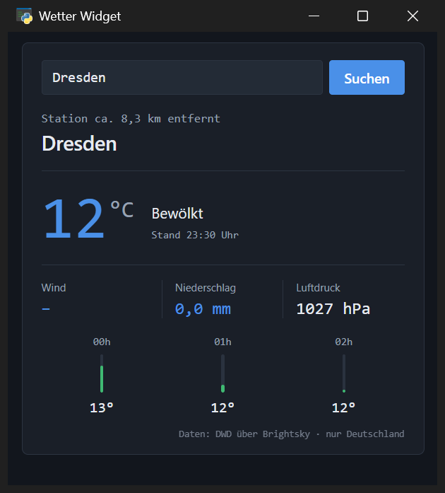
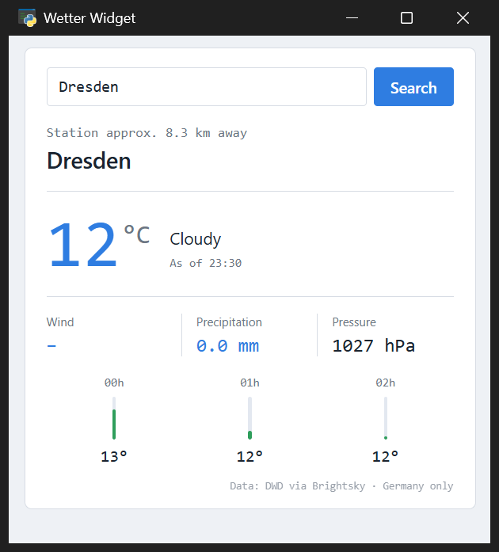
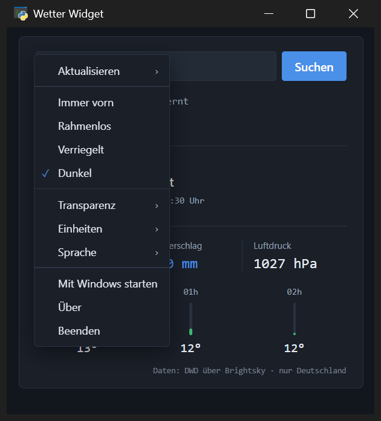
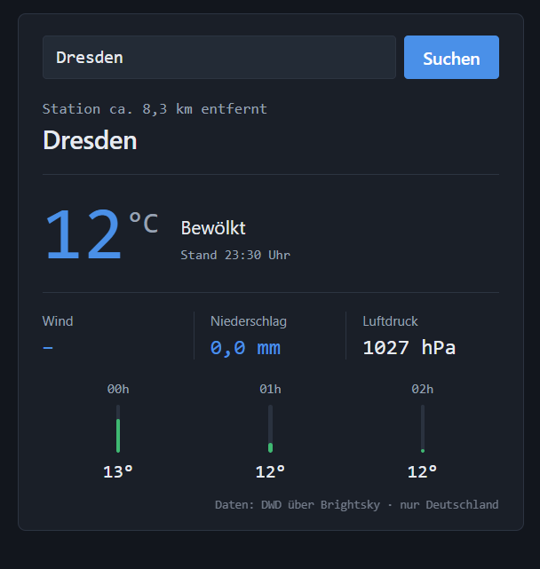
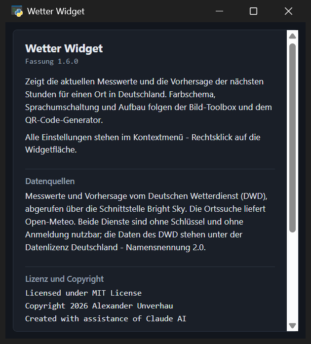

# Wetter Widget

Ein Wetter-Widget für den Windows-Desktop: aktuelle Messwerte und die
Vorhersage der nächsten Stunden für einen Ort in Deutschland, wahlweise
rahmenlos, durchscheinend und immer im Vordergrund.

Die Oberfläche ist eine HTML-Seite, die in einem nativen Fenster über die
Microsoft-WebView2-Komponente läuft - es wird **kein externer Browser**
gestartet und nichts installiert. Deutsch und Englisch, helles und dunkles
Farbschema, metrische und imperiale Einheiten.



| | |
|---|---|
|  |  |
|  |  |

## Voraussetzungen

- Windows 10 oder 11. Die WebView2-Komponente ist dort bereits enthalten;
  auf älteren Systemen liefert Microsoft sie als
  [Evergreen Runtime](https://developer.microsoft.com/microsoft-edge/webview2/)
  nach.
- Eine Internetverbindung. Ein API-Schlüssel oder eine Anmeldung wird nicht
  benötigt.

## Starten

Die fertige `WetterWidget.exe` liegt unter
[Releases](../../releases) - herunterladen, an einen festen Platz legen,
doppelklicken. Weder eine Installation noch eine Python-Umgebung sind auf dem
Zielrechner nötig, alles steckt in dieser einen Datei.

Wer lieber aus der Quelle startet:

```
pip install -r requirements.txt
python wetter_widget.py
```

Aussehen und Bedienung folgen der Bild-Toolbox und dem QR-Code-Generator:
dieselben Farbpaletten hell und dunkel, dieselbe Sprachumschaltung mit
Deutsch als Quellsprache.

## Bedienung

Im Fenster stehen nur das Ortsfeld und die Anzeige. Alles andere liegt im
**Kontextmenü: Rechtsklick auf die Widgetfläche**.

| Menüpunkt | Wirkung |
|---|---|
| Aktualisieren ▸ | *Jetzt* abrufen, und in welchem Abstand von selbst |
| Immer vorn | Fenster über allen anderen halten |
| Rahmenlos | Windows-Rahmen samt Titelleiste abnehmen |
| Verriegelt | Fenster gegen versehentliches Verschieben sichern |
| Dunkel | zwischen dunklem und hellem Schema wechseln |
| Transparenz ▸ | 0 % (deckend) bis 90 %, in Zehnerschritten |
| Einheiten ▸ | metrisch oder imperial |
| Sprache ▸ | Deutsch, English |
| Mit Windows starten | Eintrag im Autostart anlegen oder entfernen |
| Über | Fassung, Datenquellen, Lizenz und Copyright |
| Beenden | Widget schließen |

Verschoben wird das Widget, indem man es auf seiner Fläche anfasst und
zieht - das funktioniert mit und ohne Rahmen. Das Ortsfeld und die Schaltfläche
bleiben davon ausgenommen.

**Aktualisieren** bietet neben *Jetzt* die Abstände 15 und 30 Minuten,
stündlich, 3 und 6 Stunden sowie *Durch User*. Voreingestellt sind
30 Minuten. Häufiger lohnt nicht: der Deutsche Wetterdienst veröffentlicht
stündlich neue Messwerte. Der Takt beginnt nach jedem Abruf neu, ein
Aktualisieren von Hand verschiebt ihn also. Der einmal nachgeschlagene Ort
wird behalten, sodass die Ortssuche nicht bei jedem Durchgang erneut
befragt wird.

**Transparenz** endet bei 90 % und nicht bei 100 %: ein vollständig
durchsichtiges Fenster wäre unsichtbar und nur noch über die Taskleiste zu
fassen. Wer die letzte Stufe dennoch möchte, ergänzt sie in
`TRANSPARENZSTUFEN` - in `wetter_widget.py` und in `wetter-widget.html`.

**Verriegelt** sperrt das Ziehen auf der Widgetfläche. Läuft das Widget mit
Rahmen, lässt sich seine Titelleiste weiterhin greifen - Windows gibt das
nicht ohne Weiteres aus der Hand; das Fenster springt dann nach dem Loslassen
an seinen Platz zurück. Ohne Rahmen sitzt es vollständig fest.

**Rahmenlos** heißt zugleich: keine Titelleiste zum Schließen. Dafür gibt es
*Beenden* im Kontextmenü; zusätzlich bleibt der Eintrag in der Taskleiste als
Notausgang erhalten. Beim Umschalten bleibt die Anzeigefläche gleich groß -
der Rahmen kommt außen hinzu und geht außen weg, der Inhalt verrutscht nicht.

## Was sich das Programm merkt

Beim Beenden - und kurz nach jedem Verschieben oder Verändern der Größe -
schreibt das Widget seinen Zustand in `wetter-widget.json` **neben die .exe**:

| Eintrag | Inhalt |
|---|---|
| `ort` | zuletzt erfolgreich gesuchter Ort |
| `sprache` | `de` oder `en` |
| `theme` | `dark` oder `light` |
| `vordergrund` | Menüpunkt *Immer vorn* |
| `rahmenlos` | Menüpunkt *Rahmenlos* |
| `verriegelt` | Menüpunkt *Verriegelt* |
| `transparenz` | 0 bis 90 |
| `einheiten` | `metrisch` oder `imperial` |
| `intervall` | Minuten bis zur nächsten Aktualisierung, 0 = nur von Hand |
| `fenster` | Position und Größe |

Beim nächsten Start steht das Fenster wieder an seinem Platz und in seinem
Zustand. Ist der Bildschirm inzwischen weg oder kleiner geworden, rückt das
Programm das Fenster in die vorhandene Arbeitsfläche zurück, statt es
unerreichbar außerhalb zu öffnen. Die Datei darf von Hand bearbeitet werden;
wird sie gelöscht, startet das Widget mit seinen Vorgaben (Berlin, dunkel,
mit Rahmen, alle 30 Minuten, Sprache des Systems). Der Autostart steht
bewusst *nicht* in dieser Datei - dort gilt allein die Registrierung.

## Mit Windows starten

Der Menüpunkt *Mit Windows starten* legt den Eintrag selbst an, unter
`HKEY_CURRENT_USER\Software\Microsoft\Windows\CurrentVersion\Run`. Dieser
Zweig gehört dem angemeldeten Benutzer, Administratorrechte braucht es dafür
nicht. Untersagen Richtlinien das Schreiben, bleibt das Häkchen aus - das
Menü zeigt stets den tatsächlichen Zustand der Registrierung, nicht den
Wunsch aus der Einstellungsdatei.

Wird die .exe später an einen anderen Platz gelegt, trägt sich das Programm
beim nächsten Start selbst mit dem neuen Pfad nach; ein ins Leere zeigender
Autostart entsteht also nicht. Da die Einstellungen neben der .exe liegen,
sollte diese trotzdem an einem festen Platz stehen.

Von Hand geht es weiterhin über `Win`+`R` und `shell:startup`: dort eine
Verknüpfung auf `WetterWidget.exe` ablegen.

## Sprache

Ohne gespeicherte Wahl richtet sich das Widget nach der Sprache von Windows.
Die Wetterdaten kommen vom Deutschen Wetterdienst und decken nur Deutschland
ab - darauf weist die Fußzeile in jeder Sprache hin, und die Ortssuche meldet
unbekannte Orte entsprechend.

Eine weitere Sprache kommt in den Tabellen `LANGUAGE_NAMES` und
`TRANSLATIONS` am Ende von `wetter-widget.html` dazu; dort steht auch die
Anleitung. Nicht übersetzte Zeilen erscheinen automatisch auf Deutsch.

## Einheiten und Zahlen

Der Deutsche Wetterdienst liefert seine Messwerte metrisch; umgerechnet wird
allein für die Anzeige. *Einheiten ▸ imperial* macht daraus °F, mph, Zoll und
inHg, die Entfernung der Messstation in Meilen.

Die Umschaltung hängt bewusst **nicht** an der Sprache: wer Windows auf
Englisch betreibt und in Deutschland wohnt, möchte deswegen noch lange keine
Grad Fahrenheit. Beides ist getrennt einstellbar. Ein Wechsel zeichnet die
vorhandenen Messwerte neu und fragt den Wetterdienst nicht erneut.

Die Schreibweise der Zahlen richtet sich dagegen nach der **Sprache**: auf
Deutsch mit Komma (`8,3 km`), auf Englisch mit Punkt (`8.3 km`).
Tausenderpunkte bleiben aus, weil sie bei einem Luftdruck von 1027 hPa mehr
verwirren als helfen.

Ein weiteres Einheitensystem entsteht in der Tabelle `EINHEITEN` in
`wetter-widget.html` durch einen weiteren Eintrag mit denselben Feldern; die
Beschriftung im Menü kommt aus der Sprachtabelle.

## Farbschema

Die Paletten stehen als `THEMES` in `wetter-widget.html` und tragen dieselben
Rollennamen wie in den anderen Programmen (`BG`, `CARD`, `TEXT`, `ACCENT` …),
ein eigenes Schema entsteht durch einen weiteren Eintrag mit denselben Namen.

## Dateien

| Datei | Zweck |
|---|---|
| `wetter-widget.html` | Oberfläche, Farbpaletten, Sprachtabelle, Kontextmenü und Wetterabruf |
| `wetter_widget.py` | Fensterrahmen, Einstellungen, Fensterlage, Rahmen/Transparenz/Vordergrund |
| `wetter_widget.ico` | Programmsymbol |
| `build.cmd` | Baut die .exe neu |
| `requirements.txt` | Benötigte Pakete |
| `docs/` | Bildschirmfotos für diese Seite |
| `dist\WetterWidget.exe` | Das fertige Programm, entsteht beim Bauen (ca. 15 MB) |
| `wetter-widget.json` | Gespeicherter Zustand, entsteht neben der .exe beim ersten Lauf |

## Selbst bauen

```
pip install -r requirements.txt
build.cmd
```

Das Ergebnis liegt anschließend in `dist\WetterWidget.exe`. Gebaut wird mit
PyInstaller als einzelne Datei; `wetter-widget.html` wird dabei eingebettet.

## Änderungen am Widget

`wetter-widget.html` bearbeiten und anschließend `build.cmd` ausführen. Die
HTML-Datei wird beim Bauen in die .exe eingebettet, ein Neubau ist also nach
jeder Änderung nötig.

Zum schnellen Ausprobieren ohne Neubau reicht:

    python wetter_widget.py

Die HTML-Datei lässt sich außerdem direkt im Browser öffnen. Dann fehlen nur
die Fensterfunktionen - Rahmen, Transparenz, Vordergrund, Verschieben,
Beenden und das Speichern; Anzeige, Menü und Sprachumschaltung funktionieren.

Fenstergröße und Vorgabeschema stehen in `wetter_widget.py` unter
`FENSTER_BREITE`, `FENSTER_HOEHE` und `DEFAULT_THEME`.

## Technische Anmerkungen

Fensterrahmen, Transparenz und Vordergrund werden über Windows-Funktionen
gesetzt (`SetWindowLong`, `SetLayeredWindowAttributes`, `SetWindowPos`) und
nicht über die entsprechenden pywebview-Eigenschaften. Deren Wege greifen
unmittelbar auf das WinForms-Fenster zu, während die Aufrufe aus der Seite in
einem eigenen Thread ankommen - dieser Zugriff über Thread-Grenzen hinweg
blockiert das Programm.

Für diese Aufrufe legt `_user32()` eine **eigene** `WinDLL`-Instanz an. Würde
man die Signaturen an `ctypes.windll.user32` setzen, gälten sie im ganzen
Programm - auch für pywebview, dessen eigenes Fenster-Verschieben dieselbe
Funktion ruft.

## English summary

A weather widget for the Windows desktop, showing current readings and the
next few hours for a place in **Germany** - the data comes from Germany's
national weather service (DWD) and covers that country only. The interface is
an HTML page rendered in a native window through Microsoft WebView2, so no
external browser is started and nothing needs to be installed.

The interface speaks German and English (it follows the Windows language
unless told otherwise) and offers metric or imperial units, independently of
the language. Everything else lives in the context menu - right-click the
widget: refresh interval, always on top, frameless, locked in place,
transparency, dark or light scheme, start with Windows, and about.

Grab `WetterWidget.exe` from the [releases](../../releases) page, put it
somewhere permanent and double-click it. Settings are stored in
`wetter-widget.json` next to the executable.

## Lizenz und Copyright

    Licensed under MIT License
    Copyright 2026 Alexander Unverhau
    Created with assistance of Claude AI

Derselbe Vermerk steht im Kopf beider Quelldateien und im Menüpunkt *Über*,
zusammen mit der Kurzfassung der MIT-Lizenz und den Datenquellen: Messwerte
und Vorhersage vom Deutschen Wetterdienst über Bright Sky, Ortssuche über
Open-Meteo. Die DWD-Daten stehen unter der Datenlizenz Deutschland -
Namensnennung 2.0.
